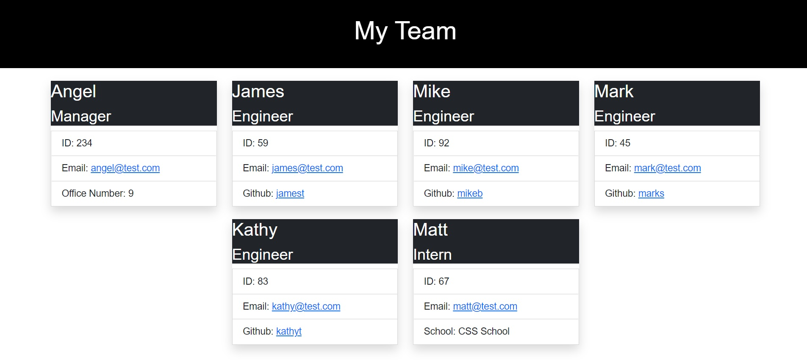
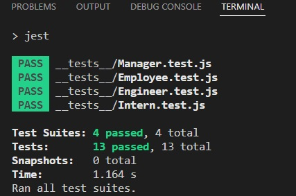

# Team Profile Generator
 

## Description
This is a CLI application that allows a person to enter in information about a company's employees starting with the Manager then following up with Engineers and Interns. It produces an HTML page that shows the hirearchy of employees similar to an organization chart. Clicking on an email link launches the default email program with the "To:" field populated. Clicking on a "GitHub" username opens that user's GitHub page.

## Technologies Used
* Jest
* OOP
* Node.js
* JavaScript
* HTML
* CSS

## Jest Tests
All tests passed as required as shown in the accompanying screenshot.

### Video Link
[https://drive.google.com/file/d/1j3VlrxQwN1GyZAkAhbHgZX307j2mWhon/view](https://drive.google.com/file/d/1j3VlrxQwN1GyZAkAhbHgZX307j2mWhon/view)

### Created by
Angel Van de Feniks
